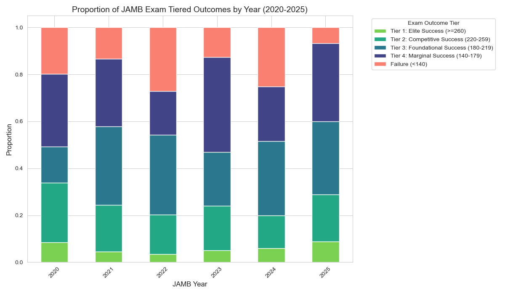
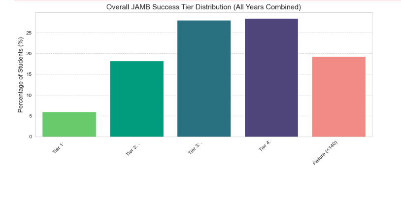
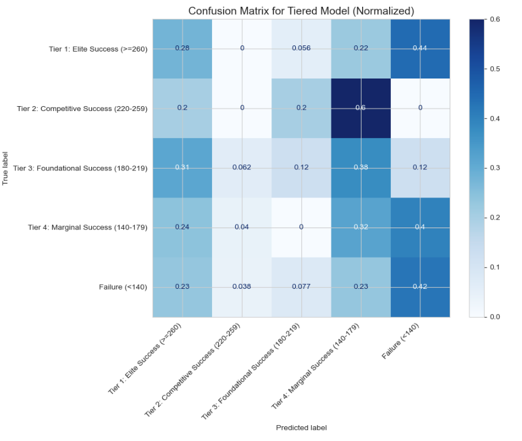
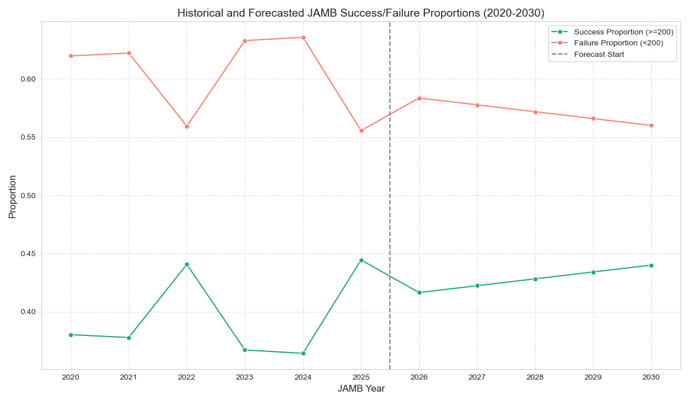

# Investigating JAMB Performance: Causes and Future Trends (2020-2030)

## Project Overview

This project aims to conduct a data-driven investigation into the root causes of fluctuating Joint Admissions and Matriculation Board (JAMB) Unified Tertiary Matriculation Examination (UTME) failure rates in Nigeria between 2020 and 2025. Leveraging survey data, the project identifies key influencing factors, builds a predictive model for student success tiers, forecasts future performance trends (2026-2030), and provides actionable recommendations for students, educators, and policymakers.

## Table of Contents

- [Investigating JAMB Performance: Causes and Future Trends (2020-2030)](#investigating-jamb-performance-causes-and-future-trends-2020-2030)
  - [Project Overview](#project-overview)
  - [Table of Contents](#table-of-contents)
  - [1. Problem Statement](#1-problem-statement)
  - [2. Project Objectives](#2-project-objectives)
  - [3. Data Source & Methodology](#3-data-source--methodology)
    - [Survey Design](#survey-design)
    - [Data Collected](#data-collected)
    - [Data Processing & Cleaning](#data-processing--cleaning)
    - [Analytical Approach](#analytical-approach)
  - [4. Key Findings from EDA](#4-key-findings-from-eda)
    - [JAMB Success Tiers](#jamb-success-tiers)
    - [Overall & Yearly Performance Trends](#overall--yearly-performance-trends)
    - [Factors Influencing Performance](#factors-influencing-performance)
  - [5. Predictive Modeling](#5-predictive-modeling)
    - [Model Objective](#model-objective)
    - [Model Performance](#model-performance)
  - [6. Future Performance Forecasting (2026-2030)](#6-future-performance-forecasting-2026-2030)
  - [7. Actionable Recommendations](#7-actionable-recommendations)
    - [For Students](#for-students)
    - [For Educators & Schools](#for-educators--schools)
    - [For Policymakers & Government](#for-policymakers--government)
  - [8. Technologies Used](#8-technologies-used)
  - [9. How to Run the Project](#9-how-to-run-the-project)
  - [10. Future Work](#10-future-work)
  - [11. Contact & Acknowledgements](#11-contact--acknowledgements)

---

## 1. Problem Statement

The Joint Admissions and Matriculation Board (JAMB) examination is a pivotal determinant for tertiary education admission in Nigeria. Over the past five years (2020-2025), there has been a concerning increase in student failure rates, impacting national human capital development and access to higher education. This project aims to move beyond anecdotal evidence by providing a data-driven analysis of this critical issue.

## 2. Project Objectives

* **Investigate Root Causes:** Analyze student data to identify demographic, behavioral (study habits), and environmental (resource access, socio-economic) factors influencing JAMB performance.
* **Predict Future Trends:** Develop a machine learning model to forecast aggregate success and failure rates from 2026 to 2030.
* **Provide Actionable Recommendations:** Propose evidence-based strategies for students, educators, and policymakers to mitigate future failure rates.

## 3. Data Source & Methodology

### Survey Design

A comprehensive survey was designed and administered via Google Forms, targeting individuals who took the JAMB UTME between 2020 and 2025.

### Data Collected

The survey captured a holistic view of influencing factors, including:
* **JAMB Performance:** Exam year(s), number of attempts, and scores.
* **Demographics:** Age, gender, secondary school type, and location.
* **Study Habits:** Daily study hours, primary study resources (multi-select), extra tutorials, study schedule consistency, and adherence.
* **Access to Resources:** Computer/smartphone availability, internet reliability, textbook access, and electricity consistency.
* **Socio-economic Background:** Guardian's highest education level, household dependents.
* **Qualitative Insights:** Biggest challenges faced and advice for future candidates.

### Data Processing & Cleaning

* **Dataset Size:** `450` unique responses were collected.
* **Initial Cleaning:** Handled inconsistent column names, special characters, and multi-select fields.
* **Data Standardisation:** Standardized categorical values (e.g., consistent capitalization, hyphen vs. en-dash in ranges, removing extraneous words like "dependents").
* **Categorical Ordering:** Key categorical features (`study_hours_per_day`, `household_dependents`, `study_plan_adherence`, `internet_reliability`, `quality_of_instruction`, `familiar_with_cbt`, `guardian_education_level`) were explicitly converted to ordered categorical types.
* **Feature Engineering:** JAMB scores were classified into 5 distinct success tiers (`exam_outcome_tiered`), and multi-select study resources were transformed into binary (0/1) features.

### Analytical Approach

The project followed a standard data science pipeline:
1.  **Exploratory Data Analysis (EDA):** In-depth statistical analysis and visualization to understand data distribution and correlations.
2.  **Predictive Modeling:** Built a supervised machine learning model for multi-class classification.
3.  **Forecasting:** Applied linear regression to project future aggregate success/failure proportions.

## 4. Key Findings from EDA

### JAMB Success Tiers

To provide a nuanced understanding, JAMB scores were categorized into:
* **Tier 1: Elite Success (>=260)**
* **Tier 2: Competitive Success (220-259)**
* **Tier 3: Foundational Success (180-219)**
* **Tier 4: Marginal Success (140-179)**
* **Failure (<140)**

### Overall & Yearly Performance Trends

* **Overall:** `~56%` of students fall into Foundational/Marginal tiers, with a significant `~19%` in the **Failure tier**.
* **Yearly Trends:** `Failure` rates peaked in **2022 and 2024**, indicating persistent challenges. 2025 showed some recovery.
* **Visualizations:**
    * 
    * 
### Factors Influencing Performance

* **Study Habits:**
    * **Study Hours:** A strong positive correlation. `4+ hours` of daily study leads to highest success and lowest failure.
    * **Study Plan Adherence:** `Always` or `Often` adhering to a study plan strongly correlates with higher success tiers and **eliminates failure**.
    * **Study Groups & Past Questions:** Both significantly boost Elite/Competitive success.
* **Familiarity with CBT:** Higher familiarity (Yes) with CBT correlates with better performance.
* **Demographics & Location:**
    * **Age:** Younger candidates (15-17 years) generally achieve higher tiers.
    * **School Location:** Urban and Semi-urban areas tend to show better performance than rural areas.
* **Resource Access:**
    * **Consistent Electricity & Internet:** Directly linked to lower failure rates.
    * **Guardian Education Level:** Generally, higher parental education correlates with better student performance.

## 5. Predictive Modeling

### Model Objective

To predict a student's `exam_outcome_tiered` (one of the 5 success tiers) based on other features.

### Model Performance

* **Model:** Random Forest Classifier
* **Overall Accuracy:** Approximately **0.2889%** on the test set.
* **Key Insight:** The model demonstrates a moderate ability to predict student success tiers, performing better on larger classes (Foundational, Marginal). Features like study hours and adherence are highly influential in predictions.
* **Visualizations:**
    * `` plot from your notebook.
* 
## 6. Future Performance Forecasting (2026-2030)

* **Methodology:** Used Linear Regression to extrapolate historical proportions of binary `Success` (>=200) and `Failure` (<200) from 2020-2025 to project trends for 2026-2030.
* **Forecast:** Projections indicate a **continuation of current Success/Failure proportions**, suggesting that without targeted interventions, existing challenges will persist.
* **Visualizations:**
  
* 
## 7. Actionable Recommendations

Based on our findings, we propose targeted recommendations for different stakeholders:

### For Students

* **Prioritize Consistent & Ample Study:** Aim for `3-4+ hours` daily; consistency is key.
* **Strictly Adhere to a Study Plan:** Develop and diligently follow a structured schedule.
* **Actively Use Past Questions & Study Groups:** Integrate into daily routine for significant performance boosts.
* **Enhance CBT Familiarity:** Practice regularly to minimize exam-day technical anxiety.

### For Educators & Schools

* **Integrate Comprehensive JAMB Prep:** Embed mandatory CBT simulations and past question practice into the curriculum from SS2.
* **Promote & Facilitate Study Groups:** Provide guidance and resources for effective collaborative learning.
* **Prioritize Quality Instruction & Feedback:** Invest in teacher development, focusing on JAMB-aligned methodologies and personalized student support.
* **Early Intervention:** Implement diagnostic assessments and targeted programs for at-risk students.

### For Policymakers & Government

* **Invest in Equitable Digital Infrastructure:** Prioritize reliable electricity and internet access, especially in rural areas.
* **Standardize Teacher Training & Resources:** Develop national standards for CBT training and provide updated digital resources.
* **Develop Targeted Support Programs:** Fund programs for at-risk regions/student profiles identified by data.
* **Continuous Evaluation of JAMB Processes:** Establish a feedback loop for ongoing assessment and policy adaptation.

## 8. Technologies Used

* **Programming Language:** Python
* **Libraries:** `pandas`, `numpy`, `matplotlib`, `seaborn`, `scikit-learn` (`RandomForestClassifier`, `LinearRegression`, `LabelEncoder`, etc.)
* **Survey Tool:** Google Forms

## 9. How to Run the Project

1.  **Clone the Repository:**
    ```bash
    git clone [your-github-repo-link]
    cd [your-repo-name]
    ```
2.  **Install Dependencies:**
    It's recommended to use a virtual environment.
    ```bash
    pip install pandas numpy matplotlib seaborn scikit-learn
    ```
3.  **Download Dataset:** Ensure the `JAMB_Cleaned_Dataset_V2.csv` file is placed in the root directory of the cloned repository.
4.  **Run Jupyter Notebook:**
    ```bash
    jupyter notebook
    ```
    Open the notebook titled `JAMB_Performance_Analysis_Prediction_Final_Revised_Code.ipynb` (or similar name you give it).
5.  **Execute Cells:** Run all cells sequentially to reproduce the EDA, predictive modeling, and forecasting.

## 10. Future Work

* **Larger & More Diverse Dataset:** Expand survey reach to include more states, urban/rural divides, and potentially integrate official JAMB performance data (if accessible).
* **Advanced Feature Engineering:** Explore creating more complex features, possibly from qualitative data using NLP.
* **Advanced Modeling:** Experiment with more sophisticated models (e.g., XGBoost, LightGBM, Neural Networks) and hyperparameter tuning for improved predictive accuracy.
* **Causal Inference:** Investigate causal relationships between factors and performance where possible, beyond correlation.
* **Interactive Dashboard:** Develop an interactive dashboard (e.g., using Dash or Streamlit) to allow stakeholders to explore findings dynamically.

## 11. Contact & Acknowledgements

* **Intern Data Analyst:** Nelson M. - [LinkedIn](https://www.linkedin.com/in/nelsonneba/)
* **Project Contributors:** *Maxwell O. Ekoh*, *Ridwan lawal*, *Adedigba Sukurat Alimot*, *Chinemerem Jane Godwin*

---
